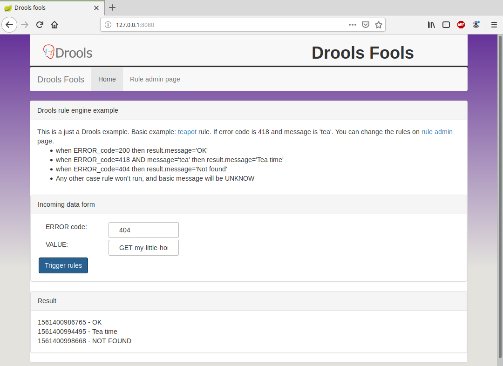

# Drools Fools

Drools based rule engine for basic use cases, with dynamic rule management. UI is based on Vue.js

There are an IncomingData object with errorCode and value parameters and based on the rules some ResultEvent objects will be generated. Rules are represented as JSON and these can be modified by Rule admin page. 

## Screenshot



## See
Articles and howtos: 
* https://github.com/kiegroup/drools/blob/master/drools-examples-api/kiefilesystem-example/src/main/java/org/drools/example/api/kiefilesystem/KieFileSystemExample.java
* https://spring.io/guides/gs/spring-boot-docker/


## Installation

Standard Spring boot application.

```bash
$ mvn spring-boot:run
```

## Docker
On Windows 10 you should enable Settings->General->'Expose daemon on tcp://localhost:2375'

```bash
$ mvn install dockerfile:build

$ docker run -p 8080:8080 -t lsmhun/droolsfools

```


## Badges
[](https://app.fossa.com/projects/git%2Bgithub.com%2Flsmhun%2Fdroolsfools?ref=badge_shield)

## License
[](https://app.fossa.com/projects/git%2Bgithub.com%2Flsmhun%2Fdroolsfools?ref=badge_large)

