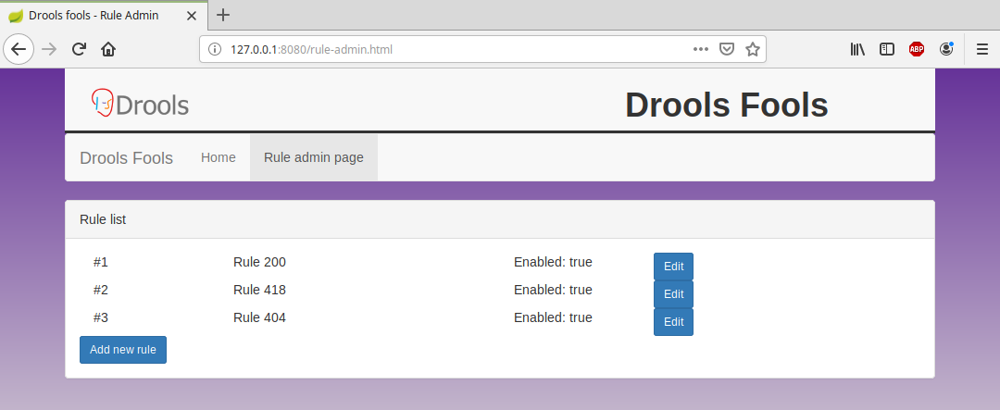
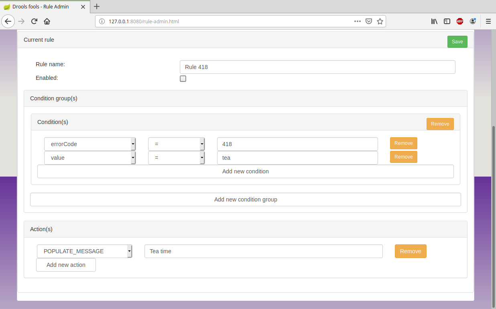

# Drools Fools

A [JBoss Drools](http://www.drools.org) az egyik legnépszerűbb szabálykiértékelő rendszer, azaz Rule engine.
Képes számos szabály leírására, egymás után fűzésére, illetve akár optimalizációra is.

Leggyakrabban DRL fájlokban definiált formában, egyfajta saját nyelvből fordít. A 6-os verziótól kezdve
több dolgot átszerveztek, és így született meg a KIE engine (Knowledge Is Everything), ami számos új 
lehetőséggel bővítette a repertoárt.

## Működés
A minta működése elég egyszerű. Egy bemenő IncomingData által reprezentált objektum érkezik JSON formában,
a Rule engine pedig a meghatározott szabályok alapján generál egy ResultEvent objektumot, ami különböző 
módon feltölt. 

A DRL fáljok zöme hasonló: adott egy _when_ ág a feltételeknek, és egy _then_ ág az 
akcióknak. Létezik egy _salience_ nevű beállítás is, amivel a prioritást lehetséges 
sorba rendezni, de használata nem kötelező. A Java szintaxison kívül egy saját MVEL formátumot
is képes befogadni, ami több kényelmi funciót is kínál. Valójában a Drools maga 
is egy programozási nyelv.

A háttérben az a szép, hogy a KIE fenntart egy virtuális fájlrendszert, amibe a szabályokat nem csak
DRL fáljokból, hanem akár generált String vagy akár Excel formátumból is be lehet tölteni.

Ebben a példában egy saját szabály reprezentáció született, amit aztán az EEARuleConverter fordít át 
DRL formátummá. Így dinamikusan lehetséges akár futás közben is változtatni.

Annak érdekében, hogy a szabályrendszernek egy féle formátumot kelljen kezelnie, egy 
IncomingDataAdapter-be lett becsomagolva az adat és ebben készül a kimeneti ResultEvent is.
Így valamivel egyszerűbb a DRL-ek fejlesztése.

UI oldalon egy sima VUE.js alkalmazás kommunikál, illetve két másodpercenként 
lekéri a teljes event listát. A mintához ez elég, de nyilván nem hatékony. A futáshoz 
szükséges élő netkapcsolat, mert CDN hivatkozásból vannak betöltve a libek.

Docker-rel elég könnyű elindítani, nem kell hozzá semmi extra.

## Képernyőképek

